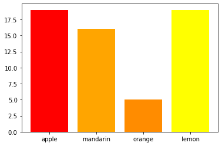
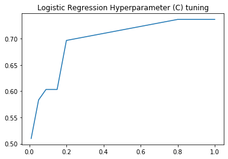
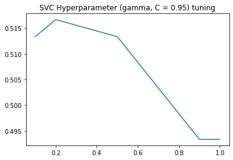
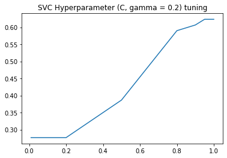
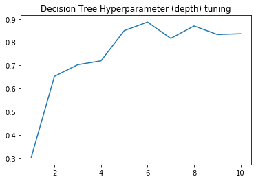
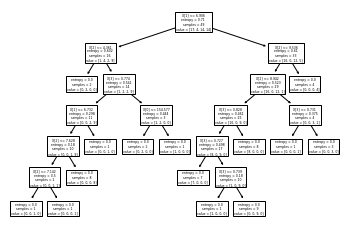
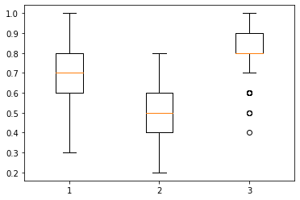

# Introduction
For this project, I am classifying fruit based on some measurements taken of them.

# Formulation
The input to this problem are measurements of different fruits. These include the mass, width, height, and color score. The color score is a normalized color value between 0 and 1. The output is an integer fruit label corresponding to a fruit. For this dataset, 1-apple, 2-mandrin, 3-orange, 4-lemon. I downloaded this dataset from a [Github repository](https://github.com/susanli2016/Machine-Learning-with-Python), but my understanding is it was created by Dr.Iain Murray at the University of Edinburgh. More information on them can be found [here](https://www.ed.ac.uk/profile/iain-murray). An interesting challenge that I was excited to tackle with this dataset is its small size. There are only 59 samples included in this dataset, which made decisions about training set, validation set, and test set size critical. I will discuss the implications of this later on.

# Approaches
For this project, my approach was very exploratory. Some of the methods I tried didn't work, and I had to tune several things to get results on this small dataset. I've included the algorithms which were most appropriate to this task based on their results.

## Baseline
Approaches and baselines (what are the hyperparameters of each approach/baseline, how do you tune them)?
Let's start with the baseline for this dataset. A quick barplot shows us that the most common label is apple or lemon, with 19 out of the 59 labels. Therefore, we could achieve 32% accuracy using the majority guess on the training set. If we assume that our classes will be evenly distributed in our test scenario, we can assume we achieve a 1/4 = 25% accuracy with the majority guess on test cases.

## General Strategy
My approach for each of the following machine learning algorithms is very similar. I randomly select a test set of size 10 and set it aside. Then, I do an exhaustive search over some hand-picked values for my hyperparameters which roughly cover the domain. For each value of hyperparameter, we report its accuracy on our validation set by averaging its performance over K=10 fold cross-validation. Afterward, we return the best performing hyperparameters and run them on our test set. An important thing to note is that since our dataset is so small there is a huge amount of variability in our final result. In an attempt to get a more consistent picture of how each algorithm performs, I repeat the process with a randomly selected test set 100 times and average the accuracy on the final test set. To be clear, no additional hyperparameter tuning is being performed for these iterations, so we are not corrupting our training set with our test set. We are simply reducing variability in results to get a better idea of what the true average performance would be for each algorithm.

## Evaluation Metric
My evaluation metric was accuracy or correct predictions over all samples. As our bar chart previously demonstrated, it is reasonable to assume that our dataset set is reasonably balanced, so we don't need any fancy scoring to complete this task. This evaluation metric is the real goal of the task.

## Logistic Regression
### Hyperparameters
* C: "Regularization parameter. The strength of the regularization is inversely proportional to C. Must be strictly positive. The penalty is a squared l2 penalty"[1](https://scikit-learn.org/stable/modules/generated/sklearn.svm.SVC.html)
* Max Iterations: Maximum number of iterations taken for the solvers to converge[2](https://scikit-learn.org/stable/modules/generated/sklearn.linear_model.LogisticRegression.html). I originally treated this as a hyperparameter, but after I added enough iterations for the solver to converge, it didn't make any difference. I opted to drop it.

### Representative Sample
Here are the results for a representative sample of my hyperparameter tuning.

| Description                 | Value              |
| --------------------------- |:------------------:|
| Best C value                | 0.8                | 
| Best Training Performance   | 0.8367346938775511 |
| Best Validation Performance | 0.7366666666666666 | 
| Test Performance            | 0.8                |

Here is the result of tuning C for logistic regression

It looks like in general, the best value of C is somewhere around 0.8 to 1

### Averaged Performance
| Description        | Value              |
| -------------------|:------------------:|
| Average Validation | 0.7509499999999999 |
| Average Test       | 0.7309999999999998 |
| Average C          | 0.7336             |

## SVM max-margin classification
### Hyperparameters
* C: "Regularization parameter. The strength of the regularization is inversely proportional to C. Must be strictly positive. The penalty is a squared l2 penalty"[1](https://scikit-learn.org/stable/modules/generated/sklearn.svm.SVC.html)
* Gamma: Kernel coefficient. TODO not 100% what this is. Might only apply to non-default kernels.

### Representative Sample
Here are the results for a representative sample of my hyperparameter tuning.

| Description                 | Value              |
| --------------------------- |:------------------:|
| Best C value                | 0.95               | 
| Best gamma value            | 0.2                | 
| Best Training Performance   | 0.8979591836734694 |
| Best Validation Performance | 0.51               | 
| Test Performance            | 0.6                |

Here is the result of tuning C and Gamma for svc. Since it is difficult to visualize 3D plots, I decided to graph how each hyperparameter looks while the other is held constant near its best value.

Gamma is best around 0.2, and C is best around 0.95-1, similar to our logistic regression result.

### Averaged Performance
| Description                  | Value               |
| ---------------------------- |:-------------------:|
| Average Validation           | 0.5502              |
| Average Test                 | 0.5350000000000003  |
| Average C                    | 0.9205999999999994  |
| Average Gamma                | 0.18499999999999986 |

## Decision Tree
### Hyperparameters
* Max Depth: The maximum depth of the decision tree.

### Representative Sample
Here are the results for a representative sample of my hyperparameter tuning.

| Description                 | Value              |
| --------------------------- |:------------------:|
| Best Max Depth              | 10                 | 
| Best Training Performance   | 1.0                |
| Best Validation Performance | 0.93               | 
| Test Performance            | 0.9                |

Here is an example of the decision tree that this algorithm generates.

### Averaged Performance
| Description                  | Value               |
| ---------------------------- |:-------------------:|
| Average Validation           | 0.8823499999999999  |
| Average Test                 | 0.8219999999999997  |
| Average Depth                | 7.93                |

## Discussion
Before jumping into the conclusion, there are a few things worth discussing. Here is a boxplot of our test scores.

An important thing to notice here is that in terms of average performance, our decision tree is best. However, it has more variability and some outliers on the lower end. That said, its average performance is so high that these outliers are still better than the range of the others. Between logistic regression and SVC, Logistic Regression performs much better on average. It does have very high variability and occasionally dips down as low as 0.3.

In terms of our baseline of 25%, all of these algorithms compare much better in comparison.

## Conclusion
Taking all factors into consideration, I would say the decision tree is the best algorithm for this task, at least of those that I tried. The high variability of results because of the tiny sample size makes comparing different algorithms challenging. Given that I averaged the performance over 100 runs, and decision trees come in the lead, I will hesitantly say decision trees are best, but would not be surprised if this changes as more fruit are sampled.

## Parting thoughts
I was very surprised by this result. Learning all these complex and impressive machine learning algorithms makes decision trees seem too simple in comparison. At the end of the day, it is a series of if statements. How could that be expressive enough? This was a valuable lesson for me. I shouldn't just blindly throw Machine Learning algorithms at a problem. It is important to make sure the model is appropriate for the task. For this problem space, it looks like the nature and relative simplicity of decision trees is exactly what is needed.

I would be very interested to see how these algorithms perform when given more samples or a larger dataset. Do decision trees perform better on smaller datasets than SVC and logistic regression, or is its success due to the nature of the problem space?
